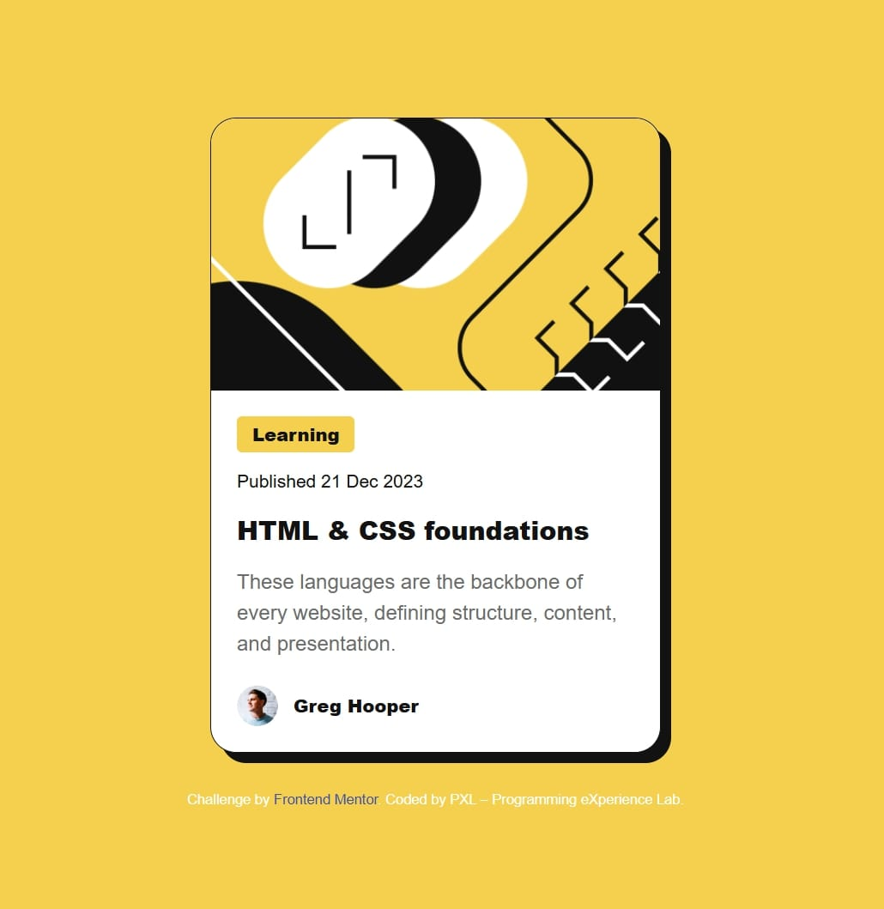

# Frontend Mentor - Blog Preview Card

## Welcome! 👋

Thanks for checking out this front-end coding challenge solution.

[Frontend Mentor](https://www.frontendmentor.io) challenges help you improve your coding skills by building realistic projects.

**This project demonstrates responsive design, interactive hover/focus states, and use of custom variable fonts (Figtree).**

---

## Project Overview

### Challenge

The goal of this challenge was to build a **responsive blog preview card** and match the design as closely as possible.  

**Requirements included:**

- See hover, focus, and active states for interactive elements.
- Responsive layout for mobile, tablet, and desktop.
- Using semantic HTML5 and CSS, with variable fonts.

### Live Preview

Check out the live version here: https://blogreviewcardx.netlify.app/

### Repository

Check out the full project code: [GitHub Repository] - https://github.com/ProgrammingeXperienceLab/blog-preview-card

---

## Built With

- HTML5
- CSS3 (Flexbox, CSS variables, transitions)
- Figtree Variable Fonts
- Mobile-first responsive design
- Optional: GitHub Pages for hosting

---

## Solution Retrospective

### What I’m most proud of

- I successfully implemented **hover, focus, and active states** on the blog title and links.
- The card layout scales beautifully across **mobile, tablet, and desktop** screens.
- Used **variable fonts** for optimized font loading and flexibility.

**Next time**, I would consider adding more **animations** or **interactive elements**, such as expanding content or a light/dark theme toggle.

### Challenges and how I overcame them

- Ensuring consistent spacing and alignment for different screen sizes was challenging.  
  → Used **Flexbox** and careful **padding/margin adjustments** with media queries.  
- Implementing **accessible keyboard focus states** for the title required adding `tabindex` and proper CSS focus styles.

### Areas for Improvement / Feedback Needed

- Are there better ways to handle **responsive typography** for very large screens?  
- Could the **hover/focus animation** be smoother without affecting performance?

---

## Screenshot

---

## Deployment

https://blogreviewcardx.netlify.app/

---

## Author

**PXL – Programming eXperience Lab**  
- GitHub: [ProgrammingeXperienceLab](https://github.com/ProgrammingeXperienceLab)  
- Frontend Mentor: [@ProgrammingeXperienceLab] - https://www.frontendmentor.io/profile/ProgrammingeXperienceLab 

---

**Have fun building!** 🚀
